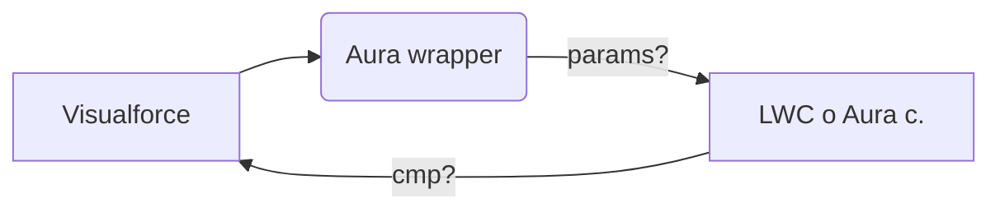
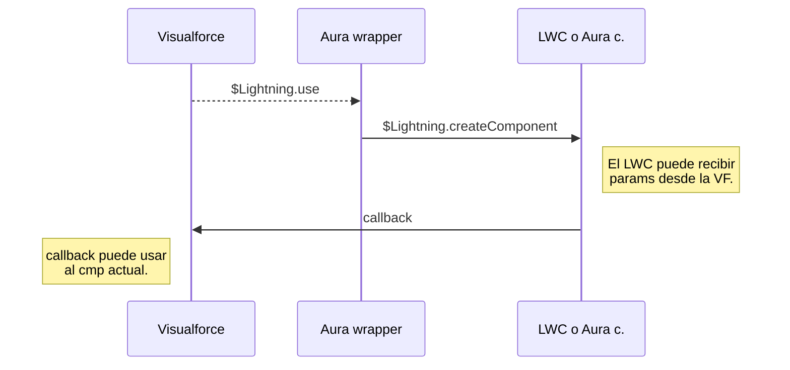
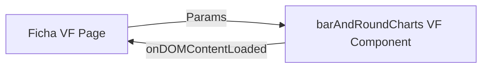

# Índice
1. [Lightning Design en Visualforce](#ld-en-vf)
1. [LWC en Salesforce Classic](#lwc-en-classic)
1. [Toasts Classic](#notif-classic)
1. [Bibliotecas JS en Salesforce](#js-en-salesforce)
1. [Implementación Chart.js en VF](#implementacion-chartjs-en-vf)
1. [Documentación](#documentacion)
<a id="ld-en-vf">
# Lightning Design en Visualforce
</a>

**Nota:** ver Trailhead sobre [Visualforce y Lightning](https://trailhead.salesforce.com/content/learn/modules/lex_dev_visualforce), que cubre varios de estos temas
**Nota 2**: off-topic, ver [Lightning Design System + Sketch](https://github.com/salesforce-ux/design-system-ui-kit)
Asumiendo que solo queramos hacer páginas Visualforce, podemos [incluir los estilos (guía oficial)](https://www.lightningdesignsystem.com/platforms/visualforce/) del [Lightning Design System](https://www.lightningdesignsystem.com) a nuestras páginas, para obtener ese *look-and-feel* sin features extra de los sistemas front de SF más nuevos. Para hacerlo, en cualquier VF Page debemos agregar:
```html
<apex:page lightningStyleSheets="true">
<apex:slds />
<div class="slds-scope">
	<!-- Contenido de la Page -->
</div>
</apex:page>
```
Esto nos añade dos posibilidades interesantes:
1. Permite **meter componentes Lightning dentro de una VF**, como por ejemplo 
1. **Lleva los viejos tags al nuevo look-and-feel** sin tener que agregar código, por ejemplo `<apex:inputField>` o `<apex:pageblock>`
#### Controller dinámico en Visualforce
Necesitamos interactuar con el *Apex controller* que define la VF Page. Para eso, si usamos Lightning Components, no podemos aprovechar el uso de `<apex:...>` con acciones estándar de llamada al controller. Además, los Component son dinámicos, así que deberíamos aprovechar eso con JavaScript (el dinamismo no es posible usando tags `<apex:...>`).
Podemos ejecutar llamadas dinámicas a los controller con [JS remoting](https://developer.salesforce.com/docs/atlas.en-us.pages.meta/pages/pages_js_remoting.htm), lo cual puede resultar más o menos conveniente según el caso de uso (por lo general es preferible usar LWC en Classic).
<a id="lwc-en-classic">
# LWC en Salesforce Classic
</a>

Salesforce Classic utiliza *Visualforce* para mostrar las fichas dentro de las apps. Necesitamos llamar desde las Visualforce a Lightning Web Components que usen JavaScript, que tendrán gráficos "lindos", conforme al requisito de Bayer.
**Nota**: para mostrar gráficos pensé en usar [chart.js](https://www.chartjs.org/), pero si hay una solución  dentro de Salesforce (que sea "linda"), bienvenida.
**Disclaimer**: otra alternativa es hacer uso de los informes y reportes de Salesforce Classic ~~o migrar a lightning~~, pero no investigué acerca de eso.
## Sobre Classic
#### Crear una app
Salesforce Classic se divide en 'aplicaciones', que no son más que un conjunto de fichas (predeterminadas y/o custom) que se muestran ante el usuario.
Para comenzar, debemos crear una aplicación que contenga las fichas que crearemos. Entonces, dentro de Classic, vamos a
> Configuración > Información general > botón "Agregar aplicación"
> o bien,
> Configuración > Compilación > Crear > Aplicaciones
> 
y elegimos un nombre para nuestro contenedor de fichas. Le agregaremos las fichas predeterminadas que queramos (luego irán agregadas las fichas custom).
**Nota**: desde aquí se puede manejar la vista según el rol del usuario (permiso y predeterminada).
#### Crear una ficha
Classic nos permite crear fichas custom, las cuales contienen una página Visualforce definida por nosotros. Para ello, vamos a
> Configuración > Compilación > Crear > Fichas

y elegimos una ***Visualforce page*** previamente subida desde el VS Code.
Ahora solo nos queda llamar a un componente LWC desde Visualforce!
## Cableado entre Visualforce y LWC

---

#### Visualforce
Debemos crear una ***Visualforce Page***, la cual debe tener la siguiente estructura:
```html
<apex:page>
	<apex:includeLightning />
	<p>Soy una Visualforce</p>
	<div id="lwcHere" />
<script>
	$Lightning.use("c:LWCwrapper",  function()  {
		$Lightning.createComponent("c:simulacionLWC",
			// JSON con params, en este caso no se usan pero lo dejo a modo de ejemplo
			{ label :  "Press Me!"  },
			"lwcHere", // div id
			function(cmp)  {
				alert("LWC was created");
				// acciones al devolver LWC
			}
		);
		}
	);
</script>
</apex:page>
```
* `<apex:includeLightning />` avisa que esta VF tiene comunicación con un LWC
* `<div id="lwcHere" />` indica que el LWC debe renderizarse aquí. Dentro de `callback` se lo llama por este mismo id
* `$Lightning.use("c:LWCwrapper", callback)` tiene como primer argumento al ***Aura component*** que indica las dependencias LWC
* `$Lightning.createComponent` debe tener como primer argumento al nombre exacto del componente LWC
	* Si es un componente estándar, el nombre deberá ser `lightning:XXX`
	* Si es un componente custom, el nombre deberá ser `c:XXX`
* Observar que se pueden manejar params de input y acciones al devolver el LWC
#### Aura wrapper
Debemos crear una ***Aura app*** que referencie las dependencias a los LWC:
```html
<aura:application access="global" extends="ltng:outApp">
	<aura:dependency resource="c:simulacionLWC" />
	...
</aura:application>
```
* `resource` debe tener el nombre exacto del componente LWC a llamar en la VF
#### LWC o Aura C.
Finalmente, se crea el ***Lightning Web Component*** o el ***Aura Component*** que tiene el comportamiento que nosotros queramos agregar.
Para este caso, veamos un requisito:
>El vendedor debe introducir la cantidad de $ que vendió. Si vendió más de 500000, es "buen vendedor". De lo contrario, es "mal vendedor".
> La pantalla debe actualizarse dinámicamente y no deben hacerse llamadas al servidor (cálculos en el frontend).

Aura Component
```html
<aura:component>
    <aura:attribute name="amountSold" type="Integer" default="500000" />
    <aura:handler name="change" value="{!v.amountSold}" action="{!c.setSellerRanking}"/>
	<aura:attribute name="sellerRanking" type="String" default="no determinada" />
	
    <lightning:layout multipleRows="true" horizontalAlign="center">
    <lightning:layoutItem size="12" padding="around-small">
        <lightning:slider label="Cantidad vendida" max="1000000" step="1000" type="horizontal" value="{!v.amountSold}" />
	</lightning:layoutItem>
	
    <lightning:layoutItem size="3" padding="around-small">
        <lightning:card title="Resultado" iconName="utility:advanced_function" variant="base">
            <div class="slds-card__body_inner">
                <div class="slds-text-align_center" style="font-size: 1.5rem;">
                    <p>${!v.amountSold}</p>
                </div>
                <div class="slds-text-align_center" style="font-size: 1rem;">
                    <p>Calificación: {!v.sellerRanking}</p>
                </div>
            </div>
        </lightning:card>
    </lightning:layoutItem>
    </lightning:layout>
</aura:component>
```
Aura Controller
```javascript
({
    setSellerRanking : function(component, event, helper) {
        let amount = component.get('v.amountSold')
        let message = ''
        if(amount < 500000)
            message = "mal vendedor"
        if(amount >= 500000)
            message = "buen vendedor"
        component.set('v.sellerRanking', message)
    }
})
```
Con esto logramos dinamismo en Salesforce Classic!
<a id="notif-classic">
# Toasts Classic
</a>

En Classic las notificaciones toast no funcionan, debido a que necesitan del _overlay_ Lightning, y Classic no puede acceder al mismo.
Con este snippet se puede **imitar Toast** dentro de Classic. Además tiene un spinner de 'cargando':
```html
<aura:component>
  <aura:attribute
    name="toastIsHiddenClassName"
    type="String"
    default="slds-hidden"
  />
  <!-- resto del componente -->
	<aura:if isTrue="{!v.toastIsHiddenClassName == ''}">
		<lightning:spinner alternativeText="Cargando..." size="large" />
	</aura:if>
  <div class="{!v.toastIsHiddenClassName}" id="notificationToastClassic">
    <div class="slds-notify_container slds-is-relative">
      <div class="slds-notify_toast slds-theme_success" role="status">
        <span class="slds-assistive-text">success</span>
        <span
          class="slds-icon_container slds-icon-utility-success slds-var-m-right_small slds-no-flex slds-align-top"
          title="Description of icon when needed"
        >
          <lightning:icon iconName="action:approval" />
        </span>
        <h2 class="slds-text-heading_small">Texto success</h2>
      </div>
    </div>
  </div>
</aura:component>
```
Código JavaScript para llamar al Toast Classic:
```javascript
cmp.set('v.toastIsHiddenClassName','')
setTimeout(() => cmp.set('v.toastIsHiddenClassName', 'slds-hidden'), 3000)
```
En el timeout se puede poner la cantidad de tiempo deseada para que desaparezca el toast (en este caso, son 3 segundos o `3000` ms)
<a id="js-en-salesforce">
# Bibliotecas JavaScript en Visualforce
</a>

#### Motivación

Si bien usar LWC dentro de Visualforce parece ser lo más estético, el uso de LWC Out tiene limitaciones. Otra alternativa (para casos donde solo se requieran bibliotecas de JavaScript) es incluir scripts con la biblioteca en las ***Visualforce Pages*** sin tener que llamar a un LWC.
Veamos un ejemplo con Chart.js. Para hacerlo, se necesita:
1. Incluir Chart.js en un `.zip` como [recurso estático en la org.](https://trailhead.salesforce.com/content/learn/modules/visualforce_fundamentals/visualforce_static_resources#add-zipped-static-resources-to-a-visualforce-page) que estemos usando
1. Hacer el siguiente código y llamar a Chart.js desde la Visualforce que hagamos (actualizado a Chart.js v2.9.3):
```html
<apex:page sidebar="false">
	<apex:includeScript value="{!URLFOR($Resource.Chartjs, 'Chart.bundle.js')}"/>
	<div class="chart-container" style="position: relative; max-width: 90vw; height: auto;">
		<canvas id="canvas" />
	</div>
	<script>
	var ctx = document.getElementById('canvas').getContext('2d');
	var myChart = new Chart(ctx, {...});
	</script>
</apex:page>
``` 
* `<apex:includeScript value="{!URLFOR($Resource.Chartjs, 'Chart.bundle.js')}"/>` es el tag que incluye al zip estático
	* El primer argumento, `$Resource.XXX` llama al estático XXX por nombre
	* El segundo nombre indica el nombre del archivo **dentro** del `.zip` subido
* El resto del código del ejemplo es dependiente de la biblioteca
#### Primera aproximación de Chart.js
**Nota:** para usar Chart.js en VF, ir directamente [a la implementación](#implementacion-chartjs-en-vf)
Para dar un primer ejemplo, hagamos un pie chart que muestre la cantidad de `Case` por cada `Account`. Vamos a necesitar:
<a id="controller-datos">
1. Un controller custom en ***Apex*** que permita obtener los datos
</a>
```java
public class AccountCasesController {
    // state
    public List<AccountWrapper> accountsWithNumberOfCases {get; private set;}
    // constructor
    public AccountCasesController() {
        if(accountsWithNumberOfCases == null)
            accountsWithNumberOfCases = new List<AccountWrapper>();
        List<AggregateResult> casesAndAccounts = [SELECT AccountId accId, Account.Name accName, COUNT(Id) amountOfCases
                                                 FROM Case
                                                 GROUP BY AccountId, Account.Name
                                                ];
        for (AggregateResult ar : casesAndAccounts)
            accountsWithNumberOfCases.add(
                new AccountWrapper(
                    (Id) ar.get('accId'),
                    (String) ar.get('accName'),
                    (Integer) (ar.get('amountOfCases') != null ? ar.get('amountOfCases') : 0)
                    )
            );
        }
        // json for visualforce
        public String getresultJson() {
            return JSON.serialize(accountsWithNumberOfCases);
        }

    // inner wrapper class
    public class AccountWrapper {
        // wrapper state
        public Account acc {get; private set;}
        public Integer amountOfCases {get; private set;}
        // wrapper constructor
        public AccountWrapper(Id accId, String name, Integer nCases) {
            acc = new Account(Id = accId, Name = name);
            amountOfCases = nCases;
        }
    }
}
```
1. Una ***Visualforce Page*** que use el controller

```html
<apex:page sidebar="false" controller="AccountCasesController">
	<apex:includeScript value="{!URLFOR($Resource.Chartjs, 'Chart.bundle.js')}"/>
	<div class="chart-container" style="position: relative; max-width: 90vw; height: auto;">
		<canvas id="canvas" />
	</div>
		<script>
		const accountList = [];
		<apex:repeat value="{!accountsWithNumberOfCases}" var="wrapper">
			accountList.push({id: "{!wrapper.acc.Id}", name: "{!wrapper.acc.Name}", amountOfCases: "{!wrapper.amountOfCases}"})
		</apex:repeat>
		const ctx = document.getElementById('canvas').getContext('2d');
		const colors = // gigantic list of precalculated colors
		let data = {
			datasets: [{
			data: accountList.map(a => a.amountOfCases),
			backgroundColor: colors.splice(0, accountList.length) // get as much colors as needed
		}],
			labels: accountList.map(a => a.name),
		}
		const myPieChart = new Chart(ctx, {
    	type: 'pie',
    	data: data,
    	options: {}
});
		</script>
		
</apex:page>
```
Este ejemplo funciona al 100% en Salesforce Classic como una ficha en una aplicación.
#### Generalizando en un componente
El inconveniente del approach previo es que hay que 'acomodar' los datos a cada caso particular. El paso siguiente es generalizar los gráficos en un componente, para poder llamarlos desde fuera con un controller y una page. Para el caso de Chart.js, para los principales tipos de gráfico, los datos se estructuran así (vamos con un ejemplo tipo [YAML](https://learnxinyminutes.com/docs/es-es/yaml-es/)):
* type: **String** `'pie'` `'doughnut'` `'line'` `'bar'`
* data: **JSON**
	* labels: ***array* String** `["Africa", "Asia", "Europe", "Latin America", "North America"]`
	* datasets: ***array* JSON**
		* label: **String** `'Population (millions)'`
		* data: ***array* Number** `[2478,5267,734,784,433]`
		* backgroundColor: ***array* color String** `["#3e95cd", ...]`, o `['rgba(99,181,152, 0.7)', ...]`
* options: **JSON**
Sabiendo esto, lo mejor sería crear un componente VF que permita manejar cualquier tipo de gráfico. Si bien Chart.js intenta [estandarizar su API](https://www.chartjs.org/docs/latest/configuration/), es necesario hacer algunos defaults por tipo de gráfico para cubrir todas las posibilidades que el usuario pueda llamar.
Por ejemplo, para ocultar un label extra en los gráficos de barra, es necesario llamar a `Chart.defaults.bar.legend = { display: false };`. Ahondando un poco más, en algunos tipos de gráfico los datos se presentan de forma distinta (ver `pie` vs. `line`), por lo que quizás sea mejor separar en componentes, agrupando según cómo definan el JSON del tipo.
<a id="implementacion-chartjs-en-vf">
# Implementación Chart.js en VF
</a>

#### Gráficos de 1 (un) dataset


Params: `title` `chartType` `allData` `width` `dataAccessors` `labelAccessors`

* **VF Page**: llama al componente de charts
```html
<apex:page sidebar="false" controller="AccountCasesController" lightningStylesheets="true">
	<apex:slds/>
	<div class="slds-grid slds-gutters">
		<div class="slds-col">	  
			<c:barAndRoundCharts title='Amount of cases per account1' chartType='pie' allData='{!resultJson}' width='30' dataAccessors='amountOfCases' labelAccessors='acc.Name' />
		</div>
		<div class="slds-col">
			<c:barAndRoundCharts title='Amount of cases per account2' chartType='doughnut' allData='{!resultJson}' width='30' dataAccessors='amountOfCases' labelAccessors='acc.Name' />
		</div>
		<div class="slds-col">	  
			<c:barAndRoundCharts title='Amount of cases per account3' chartType='bar' allData='{!resultJson}' width='30' dataAccessors='amountOfCases' labelAccessors='acc.Name' generalLabel='Amount of cases' />				
		</div>
	</div>
	<div class="slds-grid slds-gutters">
		<div class="slds-col">	  
			<c:barAndRoundCharts title='Amount of cases per account4' chartType='horizontalBar' allData='{!resultJson}' width='30' dataAccessors='amountOfCases' labelAccessors='acc.Name' generalLabel='Amount of cases' />				
		</div>
		<div class="slds-col">	  
			<c:barAndRoundCharts title='Amount of cases per account5' chartType='polarArea' allData='{!resultJson}' width='30' dataAccessors='amountOfCases' labelAccessors='acc.Name' generalLabel='Amount of cases' />				
		</div>
	</div>
</apex:page>
```
* **VF Component**: tiene la lógica del chart
``` html
<apex:component>
	<apex:includeScript value="{!URLFOR($Resource.Chartjs, 'Chart.bundle.js')}"/>
	<apex:attribute name="width" description="% of the viewport's width this component takes" type="Integer" default='90' />
	<apex:attribute name="chartType" description="Chart.js chart type" type="String" required="true" />
	<apex:attribute name="allData" description="passed data" type="String" required="true" />
	<apex:attribute name="title" description="Chart title" type="String" />

	<apex:attribute name="labelAccessors" description="{a: 1} => pass 'a'; {a:{b: 1}} => pass 'a.b'" type="String" required="true" />
	<apex:attribute name="dataAccessors" description="{a: 1} => pass 'a'; {a:{b: 1}} => pass 'a.b'" type="String" required="true" />
	<apex:attribute name="generalLabel" description="Tooltip label for each element in chart" type="String" default="" />

	<div class="chart-container" style="position: relative; max-width: {!width}vw; height: auto;">
		<canvas id="{!title}" />
	</div>
	<script>
{		const colors = ['rgba(99,181,152,0.7)','rgba(206,125,120,0.7)', ...] // +500 hardcoded colors
		const accessData = (object, accessors) => {
			let accessorArray = accessors.split('.')
			return accessorArray.reduce((acum, cur) => acum[cur], object)
		}
		window.addEventListener("DOMContentLoaded",
() => {
		// parameter parsing
		const title = '{!title}'
		const cType = '{!chartType}'
		const dAccessors = '{!dataAccessors}'
		const lAccessors = '{!labelAccessors}'
		const initialData = {!allData}
		const ctx = document.getElementById(title).getContext('2d');
		let data = {
		labels: initialData.map(a => accessData(a, lAccessors)),
		datasets: [{
			label: {!generalLabel},
			data: initialData.map(a => accessData(a, dAccessors)),
			backgroundColor: colors.splice(0, initialData.length)
			}]
		}
		// global chart defaults by type
		Chart.defaults.bar.legend = { display: false }; // dont display unnecessary labels for bar chart
		Chart.defaults.horizontalBar.legend = { display: false }; // dont display unnecessary labels for bar chart
		Chart.defaults.scale.ticks.beginAtZero = true // start number axis at 0
		// chart creation
		new Chart(ctx, {
    	type: cType,
    	data: data,
    	options: {
			title: {
        		display: true,
        		text: title
      		}
		}
		});
});
}	</script>
</apex:component>
```
* **Apex controller**: [ídem anterior](#controller-datos) en esta implementación, pero puede usarse cualquier otro set de datos
<a id="documentacion">
## Documentación
</a>

* LWC + Visualforce
	* **[Limitaciones conocidas](https://trailhead.salesforce.com/content/learn/modules/lex_dev_visualforce/lex_dev_visualforce_known_issues)**
	* [LWC guide](https://developer.salesforce.com/docs/component-library/documentation/en/lwc/lwc.get_started_introduction)
	* [LWC in Visualforce, no Aura](https://www.lightningdesignsystem.com/platforms/visualforce/)
	* [LWC message channel (de aplicación)](https://releasenotes.docs.salesforce.com/en-us/summer20/release-notes/rn_lc_message_channel.htm?edition=&impact=)
	* [JavaScript remoting, dynamic Apex controllers](https://developer.salesforce.com/docs/atlas.en-us.pages.meta/pages/pages_js_remoting.htm)
	* [Charts de LWC](https://www.lightningdesignsystem.com/guidelines/charts/)
* LWC out
	* **[Limitaciones y consideraciones](https://developer.salesforce.com/docs/component-library/documentation/lwc/lightning_out_considerations.html)**
	* **[Limitaciones, cont.](https://blog.internetcreations.com/2020/01/developer-tips-for-building-salesforce-lightning-web-components/)**
	* [Statement oficial VF-LWC (Summer '19)](https://releasenotes.docs.salesforce.com/en-us/summer19/release-notes/rn_lwc_vf.htm)
	* [Documentación oficial LWC out](https://developer.salesforce.com/docs/component-library/documentation/en/lwc/lwc.lightning_out)
	* [Sobre Lightning.use y Lightning.createComponent](https://developer.salesforce.com/docs/atlas.en-us.lightning.meta/lightning/lightning_out_markup.htm#lightning_out_markup)
* Ejemplos
	* [Ejemplo oficial](https://developer.salesforce.com/docs/atlas.en-us.pages.meta/pages/pages_flows_lightningruntime.htm)
	* [Use LWC in VF pages](https://www.paul-force.com/2019/04/24/use-lightning-web-components-in-visualforce-pages/)
	* [Problem with LWC in Visualforce](https://developer.salesforce.com/forums/?id=906F00000005I8mIAE)
* Chart.js
	* [LWC + Chart.js](https://medium.com/@ishaarora_49656/add-dynamic-data-to-chart-in-lwc-9d88e8b4516e)
	* [LWC + Chart.js + D3](https://www.forcetrails.com/2019/10/using-chartjs-in-lightning-web.html)
	* [Bar chart in LWC using Chart.js](https://www.forcetrails.com/2020/04/bar-chart-in-lightning-web-component-lwc-bar-chartjs.html)
* Visualforce
	* [Add a static resource](https://trailhead.salesforce.com/content/learn/modules/visualforce_fundamentals/visualforce_static_resources#add-zipped-static-resources-to-a-visualforce-page)
* Diseño, UX
	* [Lightning grid, responsiveness](https://developer.salesforce.com/blogs/developer-relations/2017/04/mastering-salesforce-lightning-design-system-grids-lightning-layouts.html)
	* [Layout](https://www.lightningdesignsystem.com/guidelines/layout/)
	* [Prototyping, L app builder](https://trailhead.salesforce.com/content/learn/modules/ux-prototyping-basics)
	* [Prototyping tools](https://medium.com/stormchaser-ux/prototyping-with-lightning-design-system-what-tool-should-you-use-edf937c6a1de)
		* [Lightning + Sketch](https://github.com/salesforce-ux/design-system-ui-kit)
		* [Design system starter kit](https://github.com/salesforce-ux/design-system-starter-kit)
		* [Avonni Creator](https://www.avonni.app/)